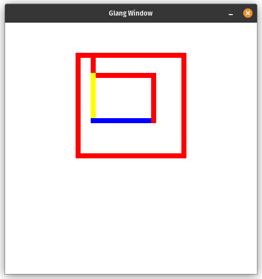

# Gletch-A-Sketch
It's like the Etch-A-Sketch toy, but implemented in the [Glang](https://github.com/blidddev/glang) programming language!
This was created live on my [Twitch](https://twitch.tv/Dorbellprod).
## How to run
1. Follow instructions in the [Glang repository](https://github.com/bliddev/glang) on setting up the Glang interpreter.
2. With your interpreter located, run it with `main.glg`.

e.g.
```
./glang C:/repos/gletch-a-sketch/src/main.glg
```
## How to use
- Use WASD to control your "cursor".
- Use LShift to alternate between colours red, yellow, blue, and white.
- Press Space to clear the screen.
## Screenshots


# Credits
[Blid](https://youtube.com/BlidDev) - programming language
